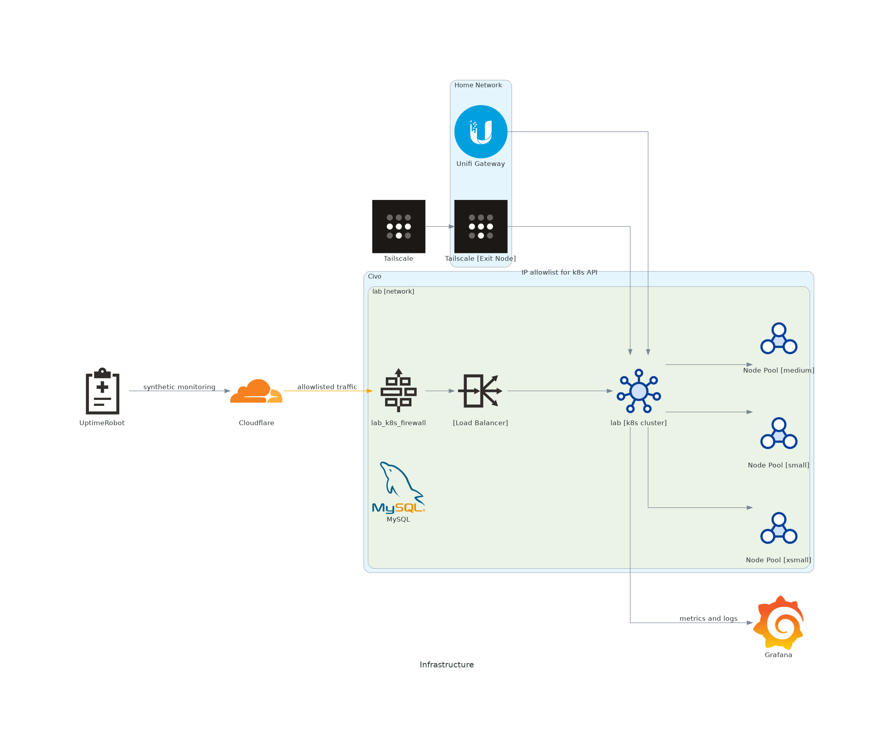

## Cloudflare

Cloudflare is used for:

- SSL termination (so I don't need to run CertManager)
- WAF/DNS protection

## Civo

I host my Kubernetes cluster on [Civo](https://civo.com/), a Kubernetes-first cloud native service provider.

### Firewall

HTTP/HTTPS traffic is restricted to Cloudflare public IPs and my home IP.

### Kubernetes

I'm using a `k3d` cluster for Kubernetes.
