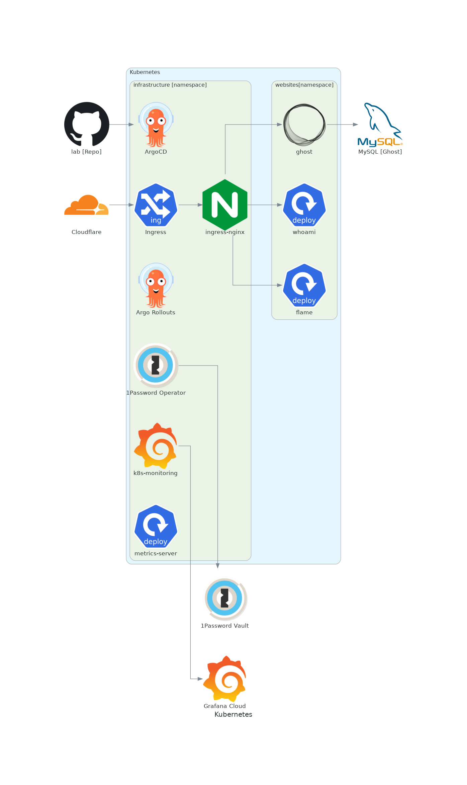

## Deployment

Applications are (for now) deployed through Helm charps "wrapping" public Helm charts as subcharts.  This means I can use [renovate](https://github.com/renovatebot/renovate) to keep charts up to date!

Deployments are done through ArgoCD in a Gitops-ey way.

## Secrets

Secrets are managed through the [1Password Kubernetes Operator](https://developer.1password.com/docs/k8s/k8s-operator).  Since I'm only using a single licence, this is free (with the price of a family plan).
