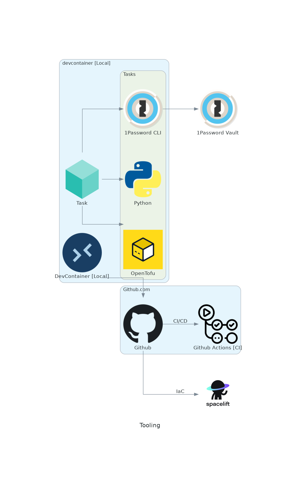

## Devcontainer

After losing a few local environments, I've decided to use an Ubuntu-based `.devcontainer` to automate my development environment.  It's a little chonky (hi pyenv!) but it's nice to automate all the things.

## Task

I use [task](https://taskfile.dev/) as an easier to use / more flexible task runner.

## Python

I use [pyenv](https://github.com/pyenv/pyenv) to manage Python installations and [poetry](https://python-poetry.org/) for dependency management.  Dependencies are automatically installed as part of devcontainer bootstrapping.

## OpenTofu

I'm taking [OpenTofu](https://opentofu.org/) for a spin!

## Spacelift

I'm using [Spacelift](https://spacelift.io/) for Terraform/OpenTofu adjacent tasks including:

- state management
- PR checks
- Applyign Terraform on merge

Basically it automates a significant amount of CI/CD and has a very generous free tier!
